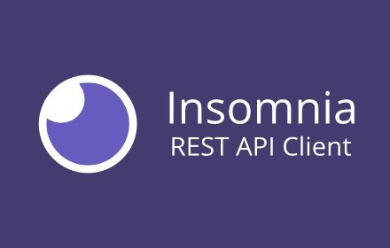

# Insomnia
My works related to Insomnia

## Table of Contents
1. [Introduction.](#introduction)
2. [Official references websites.](#references)
3. [Insomnia shortcuts.](#shortcuts)
4. [GitHub notes.](#github)
5. [GitHub repository calculation.](#calculation)

<a name="introduction"></a>
## 1. Introduction.
 
Insomnia is a free cross-platform desktop application that takes the pain out of interacting with HTTP-based APIs. Insomnia combines an easy-to-use interface with advanced functionality like authentication helpers, code generation, and environment variables.

<a name="references"></a>
## 2. Official references websites.
Official Insomnia website : https://insomnia.rest/ <br />
Official Insomnia documentation : https://support.insomnia.rest <br />

**_Insomnia commands_** <br />
httpbin.org : https://httpbin.org <br />

**_Insomnia JSON references_** <br />
JSON Path by Stefan Goessner : https://goessner.net/articles/JsonPath/

<a name="shortcuts"></a>
## 3. Insomnia shortcuts.
**[ Ctrl ]** + **[ N ]** : create new request <br />
**[ Ctrl ]** + **[ Enter ]** : send request <br />
**[ Ctrl ]** + **[ D ]** : duplicate request <br />
**[ Shift ]** + **[ Ctrl ]** + **[ Delete ]** : delete request <br />

<a name="github"></a>
## 4. GitHub notes.
Clone the current GitHub remote repository contents into local machine.
```
$ git clone https://github.com/syakirharis25/Insomnia.git
$ cd Insomnia/
$ git remote -v
$ git status
```

<a name="calculation"></a>
## 5. GitHub repository calculation.
```
-------------------------------------------------------------------------------
Language                     files          blank        comment           code
-------------------------------------------------------------------------------
Markdown                         1              5              0             24
-------------------------------------------------------------------------------
```
Refer to : https://github.com/syakirharis25/cloc
